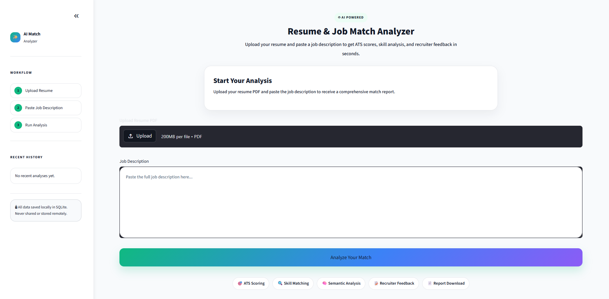
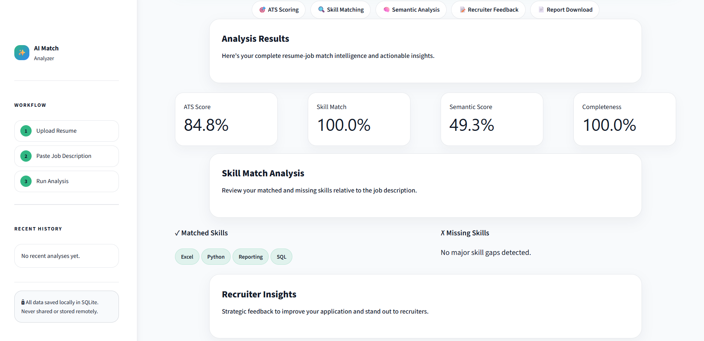
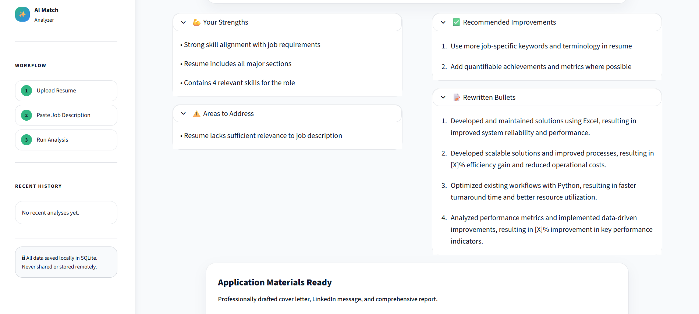

# AI Resume & Job Match Analyzer


## 🎯 Overview

AI Resume & Job Match Analyzer is a production-quality tool that analyzes the alignment between your resume and job descriptions using advanced NLP and scoring algorithms. Get instant feedback on skill matches, ATS compatibility, and actionable improvement suggestions.

**Key Features:**
- 📄 **PDF Resume Parsing** - Extract text from resumes automatically
- 🎯 **ATS Score Calculation** - Get a comprehensive match score (0-100)
- 🔧 **Skill Analysis** - Identify matched and missing skills
- 💡 **AI Feedback** - Receive actionable improvement suggestions
- 📝 **Cover Letter Generator** - Auto-generate professional cover letters
- 💼 **LinkedIn Message Template** - Ready-to-use recruiter outreach
- 📊 **Detailed Reports** - Download comprehensive analysis reports
- 💾 **History Tracking** - Store and review past analyses

## 🏗️ Architecture

### Technology Stack

- **Frontend:** Streamlit (Python web framework)
- **Backend:** FastAPI (RESTful API)
- **NLP:** Scikit-learn (TF-IDF, cosine similarity)
- **PDF Processing:** PyMuPDF
- **Database:** SQLite (local) / PostgreSQL (production)
- **Testing:** Pytest

### Project Structure

```
ai-resume-job-match-analyzer/
├── app/                          # Streamlit frontend
│   └── streamlit_app.py         # Main application
├── backend/                      # FastAPI backend
│   └── main.py                  # API endpoints
├── core/                         # Business logic
│   ├── parser/                  # Text parsing modules
│   │   ├── resume_parser.py
│   │   └── job_parser.py
│   ├── scoring/                 # Analysis algorithms
│   │   ├── skill_extractor.py
│   │   ├── match_engine.py
│   │   ├── semantic_matcher.py
│   │   └── ats_scorer.py
│   ├── generators/              # Content generation
│   │   ├── feedback_generator.py
│   │   ├── resume_rewriter.py
│   │   ├── cover_letter_generator.py
│   │   ├── linkedin_message_generator.py
│   │   └── report_generator.py
│   └── utils/                   # Utilities
│       └── text_cleaner.py
├── database/                     # Database management
│   └── db_manager.py
├── tests/                        # Unit tests
│   ├── test_text_cleaner.py
│   ├── test_skill_extractor.py
│   └── test_ats_scorer.py
├── data/                         # Data directories
│   ├── uploads/                 # Uploaded PDFs
│   └── outputs/                 # Generated reports
├── docs/                         # Documentation
│   └── architecture.md
├── requirements.txt              # Dependencies
├── README.md                     # This file
├── DEPLOYMENT.md                 # Deployment guide
└── .gitignore                    # Git ignore rules
```
## 🚀 Live Demo

🔗 [Try the live app](https://ai-resume-job-match-analyzer.streamlit.app)

## 📸 Screenshots

### Home Page


### Analysis Dashboard


### Recruiter Insights & Reports



## 🚀 Quick Start

### Prerequisites

- Python 3.8 or higher
- pip (Python package manager)
- Git

### Installation

1. **Clone the repository**
   ```bash
   git clone https://github.com/thirurishi/ai-resume-job-match-analyzer.git
   cd ai-resume-job-match-analyzer
   ```

2. **Create and activate virtual environment**
   ```bash
   # Windows
   python -m venv venv
   venv\Scripts\activate
   
   # macOS/Linux
   python -m venv venv
   source venv/bin/activate
   ```

3. **Install dependencies**
   ```bash
   pip install -r requirements.txt
   ```

4. **Run the application**
   ```bash
   streamlit run app/streamlit_app.py
   ```

   The app opens at: `http://localhost:8501`

## 📖 How to Use

1. **Upload Resume** - Select a PDF resume file (supports text-based PDFs)

2. **Paste Job Description** - Copy and paste the job posting

3. **Click Analyze** - The system processes both documents

4. **Review Results:**
   - **ATS Score** - Overall match percentage (0-100)
   - **Skill Analysis** - Matched and missing skills
   - **Feedback** - Strengths, weaknesses, improvement suggestions
   - **Resume Bullets** - ATS-friendly bullet point examples
   - **Cover Letter** - Auto-generated professional letter
   - **LinkedIn Message** - Ready-to-send recruiter message

5. **Download Report** - Save full analysis as text file

6. **View History** - Access past analyses in sidebar

## 🧪 Testing

Run the test suite:

```bash
# Run all tests
pytest

# Run with verbose output
pytest -v

# Run specific test file
pytest tests/test_text_cleaner.py

# Generate coverage report
pytest --cov=core tests/
```

**Test Coverage:**
- Text cleaning and normalization
- Skill extraction and matching
- ATS scoring algorithm
- Edge cases and error handling

## 📊 Scoring Formula

### ATS Score Calculation

```
ATS Score = (Skill Match % × 50%) + (Semantic Score × 30%) + (Completeness % × 20%)
```

**Components:**

- **Skill Match (50%):** Percentage of job-required skills found in resume
- **Semantic Similarity (30%):** TF-IDF based relevance analysis
- **Resume Completeness (20%):** Presence of key sections (education, experience, skills, projects, certifications)

**Score Interpretation:**
- 80-100: Strong match ✅
- 60-79: Good match 👍
- 40-59: Moderate match 📊
- 0-39: Low match ⚠️

## 🔧 Configuration

### Environment Variables

Create `.env` file in project root (optional):

```env
ENVIRONMENT=development
DATABASE_PATH=database/analysis_history.db
```

### Database

- **Local:** SQLite (automatic setup)
- **Cloud:** Streamlit Cloud (automatic)
- **Production:** PostgreSQL (see DEPLOYMENT.md)

## 📤 Deployment

For detailed deployment instructions, see [DEPLOYMENT.md](DEPLOYMENT.md)

### Quick Deploy to Streamlit Cloud

1. Push code to GitHub
2. Go to [share.streamlit.io](https://share.streamlit.io)
3. Connect repository and deploy
4. App available at: `https://<app-name>.streamlit.app`

## 📝 API Reference

### FastAPI Backend Endpoints

**GET /:**
```json
{
  "message": "AI Resume & Job Match Analyzer API is running"
}
```

Future endpoints will support:
- Resume analysis via API
- Batch processing
- Historical data retrieval

## 🐛 Troubleshooting

### "ModuleNotFoundError: No module named 'core'"
```bash
# Ensure you're in correct directory
cd ai-resume-job-match-analyzer
streamlit run app/streamlit_app.py
```

### PDF upload fails
- Ensure PDF is text-based (not scanned/image-based)
- Check file size is reasonable (<50 MB recommended)
- Verify PyMuPDF is installed: `pip install pymupdf`

### Port 8501 already in use
```bash
streamlit run app/streamlit_app.py --server.port 8502
```

### Tests fail
```bash
# Ensure pytest is installed
pip install pytest pytest-cov

# Run from project root
cd ai-resume-job-match-analyzer
pytest -v
```

## 🔐 Security Considerations

- **No data is permanently stored** (PDFs not saved)
- **Analysis metadata** stored locally in SQLite
- **No external API calls** (local processing only)
- **Safe for sensitive information** - everything runs locally

## 🎓 Educational Value

This project demonstrates:
- Modern Python web development (Streamlit)
- NLP & text analysis techniques
- Database design and management
- Software testing best practices
- Production deployment patterns
- Clean code architecture

## 📈 Performance

- **Analysis Speed:** < 5 seconds per resume
- **PDF Processing:** Handles multi-page resumes
- **Scalability:** Streamlit Cloud for 100-1000 users
- **Database:** SQLite for MVP, PostgreSQL for enterprise

## 🚀 Future Improvements

### Phase 6: Advanced Features
- [ ] OpenAI GPT integration for smarter feedback
- [ ] LinkedIn profile import
- [ ] Batch resume analysis
- [ ] Email notifications
- [ ] User authentication & accounts

### Phase 7: Enterprise Features
- [ ] PostgreSQL backend
- [ ] Advanced analytics dashboard
- [ ] Recruiter portal
- [ ] Interview prep module
- [ ] Salary prediction

### Phase 8: Monetization
- [ ] Freemium subscription model
- [ ] Premium features
- [ ] API for enterprise
- [ ] White-label solution

## 📄 License

This project is licensed under the MIT License - see LICENSE file for details.

## 🤝 Contributing

Contributions welcome! Please follow these steps:

1. Fork the repository
2. Create feature branch: `git checkout -b feature/amazing-feature`
3. Commit changes: `git commit -m 'Add amazing feature'`
4. Push to branch: `git push origin feature/amazing-feature`
5. Open pull request

## 👨‍💻 Author

Built as a production-quality portfolio project to demonstrate full-stack development capabilities.

## 📞 Support

- GitHub Issues: https://github.com/thirurishi/ai-resume-job-match-analyzer/issues
- Documentation: See `/docs` directory
- Portfolio: Add your portfolio link here

## 🙏 Acknowledgments

- Streamlit for the amazing framework
- scikit-learn for NLP capabilities
- PyMuPDF for PDF handling
- The open-source community

---

**Last Updated:** May 2026 | **Version:** 1.0.0
